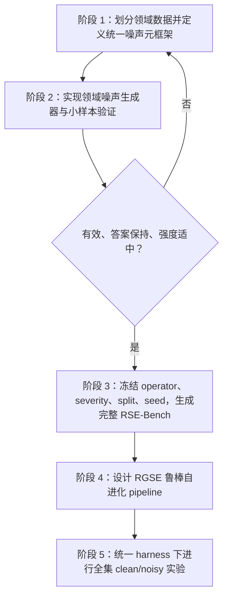

# RobustSkillEvoBench 与鲁棒 Skill Self-Evolution Pipeline 设计

**状态：** 设计规格，等待用户复核后进入实现计划
**日期：** 2026-08-11
**项目目录：** `/home/nvidia/yutao/lzt/self-evolution-robustness`
**Benchmark 工作名：** RobustSkillEvoBench（简称 RSE-Bench）
**方法工作名：** Reliability-Guided Skill Evolution（简称 RGSE）

## 1. 项目目标与论文立意

本项目不是以“分析不同噪声会造成多大性能下降”为最终目标，而是提出：

1. 一个用于评测 **Skill Self-Evolution 在现实噪声下是否仍然有效** 的跨领域 benchmark；
2. 一个能够从带噪任务、证据、工具观察和反馈中进行可靠 self-evolution 的 pipeline；
3. 一套统一 harness，使现有方法与 RGSE 在相同模型、任务、预算和 verifier 下公平比较；
4. 一组机制诊断实验，解释噪声如何被吸收到 skill 中、如何造成负向演化，以及 RGSE 为什么能够缓解这一问题。

论文需要验证以下核心命题：

- 现有 self-evolution 方法在 clean benchmark 上能够产生收益；
- 当 evolution experience 含有现实、答案保持不变的噪声时，现有方法的 evolution gain 明显下降，部分情况下出现 negative evolution；
- RGSE 在 RSE-Bench 上获得更高的 robust evolution gain 和更低的 negative evolution rate；
- RGSE 在原始 clean benchmark 上仍然具有不弱于现有方法的 self-evolution 能力。

噪声分类、强度分析和 Skill-native 诊断是 benchmark 构建和方法设计的支撑，不作为论文的第一贡献。

### 1.1 非目标

RSE-Bench v1 不试图：

- 穷举所有现实噪声；
- 将随机字符扰动、无约束 OCR 破坏或直接修改 gold answer 当作主要噪声；
- 用一个混合准确率把不同领域、不同 verifier 的任务直接微平均；
- 通过在最终 test 上反复挑选最能让 baseline 掉点的噪声来构造 benchmark；
- 强制所有方法使用完全相同的内部 skill 表示或更新算法。

## 2. 总体研究流程

项目严格按五个阶段执行，前两个阶段允许在 pilot 数据上循环，第三阶段冻结 benchmark，第四阶段之后才设计并优化 RGSE。



关键顺序约束：

- pilot 只能使用嵌套在最终 evolution split 中的数据；
- final validation/test 在噪声设计阶段不可用于 operator 调整；
- RGSE 的主要设计与调参在 benchmark freeze 之后开始；
- RGSE 不参与噪声 operator 的准入决策，避免 benchmark 反向适配本方法；
- 全集实验使用冻结的 benchmark 版本和 manifest，不在运行中重新生成噪声。

## 3. Benchmark 的评测对象

普通 noisy benchmark 多数只评测固定模型在 noisy test 上的执行鲁棒性。RSE-Bench 评测的是完整演化过程：

```text
Initial Skill
  → Clean/Noisy Evolution Tasks
  → Trajectories + Tool Observations + Feedback
  → Self-Evolution Method
  → Evolved Skill
  → Clean/Noisy Held-out Evaluation
```

一个 benchmark run 的输出不只是答案，还包括：

- evolution 前后的 skill bundle；
- evolution task 的完整 trajectory；
- tool observation、verifier feedback 和 method decision；
- 被接受和拒绝的 skill patch；
- clean/noisy test 的任务级结果；
- token、时间、工具调用和模型调用成本。

## 4. 领域、数据集与方法范围

### 4.1 RSE-Bench v1 核心领域

| 领域 | 核心 evolution/ID benchmark | OOD benchmark | 主要 baseline |
|---|---|---|---|
| Spreadsheet/Table | SpreadsheetBench-Verified | WikiTableQuestions 固定子集 | Trace2Skill、SkillOpt、SkillGrad |
| Document QA/Retrieval | OfficeQA Full、DocVQA 固定子集 | 同 benchmark held-out；扩展版加入 SearchQA/SealQA | SkillOpt、Trace2Skill、EvoSkill |
| Mathematical Reasoning | DAPO-Math 固定子集 | LiveMathematicianBench、AIME 2026 | Trace2Skill、SkillOpt |

### 4.2 v1.1 扩展而非 v1 阻塞项

- HiTab：层级表格 OOD；
- SpreadsheetBench 非 Verified 部分：需要额外确认 verifier 可靠性；
- SearchQA、SealQA：用于扩大文档/检索任务覆盖；
- MathArena rolling competitions：用于后续动态、低污染 OOD；
- SkillsBench、SkillFlow、Skill-X：作为 Skill Contamination Diagnostic Suite，不进入三个任务领域的主微平均。

### 4.3 原生复现与统一主实验分离

每个方法先按官方配置完成一次 native reproduction，用于确认安装、数据、skill 更新和 verifier 行为正确。随后主论文实验切换到统一设置：

- 执行与演化模型：GPT-5.5；
- agent harness：Codex CLI；没有原生 Codex 支持的方法接入同一 OpenAI-compatible execution layer；
- 相同 task manifest、模型参数、工具权限、最大 turns、token budget 和 evolution budget；
- 方法保留自身的 skill induction、reflection、gradient、merge 或 validation 算法；
- 官方复现结果与统一结果分表报告，不能混为一组数字。

## 5. 数据划分设计

### 5.1 通用分层

每个核心数据集划分为：

```text
EVOLUTION
├── PILOT_EVOLVE   # 小样本噪声/演化验证，嵌套在 EVOLUTION 内
├── PILOT_EVAL     # 小样本效果检查，嵌套在 EVOLUTION 内
└── REMAINING_EVOLVE

VALIDATION_CLEAN   # 主实验 checkpoint gate，仅 clean

TEST
├── TEST_CLEAN
├── TEST_NOISY_SEEN
└── TEST_NOISY_UNSEEN
```

设计噪声时只能读取 `PILOT_EVOLVE` 和 `PILOT_EVAL`。最终测试任务及其 noisy variant 在 operator 和 severity 冻结后一次性生成。

### 5.2 v1 目标 split

| Benchmark | Evolution | Pilot（嵌套于 Evolution） | Clean validation | Final test |
|---|---:|---:|---:|---:|
| SpreadsheetBench-Verified | 200 | 30 evolve + 10 eval | 20 | 180 |
| OfficeQA Full | 50 | 12 evolve + 8 eval | 24 | 172 |
| DocVQA 固定 10% 子集 | 107 | 20 evolve + 10 eval | 53 | 374 |
| DAPO-Math 固定子集 | 400 | 30 evolve + 20 eval | 100 | 500 |
| WikiTableQuestions | 不用于 v1 evolution | 不参与 pilot | 0 | 500 OOD |
| LiveMathematicianBench | 不用于主 evolution | 不参与 pilot | 0 | 125 OOD |
| AIME 2026 | 不用于 evolution | 不参与 pilot | 0 | 30 OOD |

数据泄漏控制：

- SpreadsheetBench 按原始 task ID 分组；同一 task 的多个 workbook test case 不跨 split；
- OfficeQA 按 `source_files`/source document group 分组；若一个问题引用多个文档，按连通分量分组；
- DocVQA 按 `docId` 分组，同一文档页面的问题不跨 split；
- DAPO 对标准化题面、来源和答案进行去重，近重复题通过 embedding + 数学表达式签名检查；
- WikiTableQuestions 按 table ID 分组；
- LiveMathematicianBench 按 paper link 分组并固定 2026-04-04 数据快照；
- 具体 task ID 由发布的 split manifest 决定，所有实验只引用 manifest，不在运行时重新随机切分。

### 5.3 Clean validation 原则

主实验只向方法提供 clean validation gate，防止方法直接针对已知噪声验证集调参。Noisy validation 仅作为明确标记的 ablation。方法可以从 evolution task 自行构造内部 probe，但这些调用计入统一预算。

## 6. 跨领域统一噪声元框架

RSE-Bench 使用两级 taxonomy：第一级描述噪声进入 self-evolution 系统的位置，第二级描述噪声如何改变载体。领域 pipeline 只负责把抽象组合落到具体数据格式。

### 6.1 四个宏观噪声通道

| ID | 通道 | 定义 | 在 benchmark 中的位置 |
|---|---|---|---|
| C1 | Task Communication | 用户目标周围包含冗余、误导或低质量表达 | evolution 与 test |
| C2 | Evidence/Artifact | 文件、文档、表格或上下文中存在干扰证据 | evolution 与 test |
| C3 | Interaction/Observation | 检索、工具和环境 observation 不完整、不稳定或排序异常 | evolution 与 test |
| C4 | Feedback/Selection | self-evolution 获得的 reward、错误诊断或选择信号不可靠 | 仅 evolution；主诊断/消融 |

C1–C3 构成主 leaderboard 的 Environmental Noise。C4 直接作用于学习信号，单列为 Feedback Robustness Track，避免与测试环境噪声混淆。

### 6.2 六个跨领域变化机制

| ID | 机制 | 抽象操作 | 示例 |
|---|---|---|---|
| M1 | Addition | 加入额外但非必要内容 | 冗余背景、decoy sheet、无关定理 |
| M2 | Distortion | 加入看似合理但错误或偏置的信息 | 失败公式、错误搜索提示、错误引理 |
| M3 | Omission | 隐藏、截断或只返回部分信息 | 截断 preview、partial snippet、缺失反馈 |
| M4 | Duplication/Staleness | 提供重复、旧版或冲突版本 | Backup sheet、旧文档、缓存结果 |
| M5 | Reordering/Access | 改变顺序、rank 或可见性 | gold rank displacement、sheet 顺序、结果重排 |
| M6 | Instability | 第一次访问失败或结果不稳定，但存在恢复路径 | timeout、empty result、retryable tool error |

一个噪声算子由三元组定义：

```text
Noise Operator = Channel × Mechanism × Domain Carrier
```

例如：

```text
C2 × M4 × Spreadsheet Sheet  = stale backup sheet
C2 × M1 × OfficeQA Corpus    = semantic decoy document
C3 × M5 × Retrieval Results  = gold document rank displacement
C1 × M2 × Math Prompt        = flawed partial solution
```

这种设计允许论文用四个宏观通道讲统一故事，同时允许每个领域使用自然、有效的具体实现。

### 6.3 NoiseMetaSpec

所有领域的噪声实例使用同一 schema：

```yaml
noise_id: "officeqa-C2-M4-stale-doc-L2-s42"
channel: "C2-evidence"
mechanism: "M4-staleness"
operator: "stale_document"
domain: "document"
benchmark: "officeqa"
carrier:
  type: "retrieval_document"
  source_path: "..."
scope:
  insertion_point: "retrieval_index"
  protected_regions: ["gold_document", "answer_span"]
severity:
  level: "L2"
  budget: 2
  semantic_similarity: 0.82
  gold_rank: 5
timing: "evolution"
persistence: "per-task"
generator:
  mode: "hybrid"
  version: "..."
seed: 42
provenance:
  clean_hash: "..."
  noisy_hash: "..."
validation:
  structural_valid: true
  label_invariant: true
  solvable: true
  answer_leak_free: true
```

### 6.4 强度不是单一“扰动数量”

统一强度向量定义为：

\[
\lambda=(b,s,a,p)
\]

- \(b\)：noise budget，加入或影响多少个单位；
- \(s\)：干扰与 gold 的语义相似度；
- \(a\)：干扰接近目标证据或关键步骤的程度；
- \(p\)：故障概率、污染比例或 gold rank。

等级定义：

| 等级 | 设计目标 |
|---|---|
| L0 | 原始 clean task |
| L1 | 单个低至中相似度干扰；恢复成本低 |
| L2 | 1–2 个高相似度干扰或明显 rank/partial observation 影响；主 leaderboard 强度 |
| L3 | 多个高相似度干扰、重复故障或更深 rank；仍保持可解，不允许进入任务失效区 |

不同领域的具体数值不要求相同，必须通过 pilot 把 L2 校准到“明显区分方法但不使任务进入地板效应”的区域。

### 6.5 Label-preserving contract

C1–C3 必须满足：

1. 原始用户目标完整保留；
2. gold answer、目标 workbook、correct choice 或官方 verifier 不变；
3. gold evidence 仍然存在且存在可执行恢复路径；
4. 噪声不得直接泄露答案；
5. 新增冲突内容必须被标记为用户猜测、失败尝试、旧版本或非权威来源，不能成为新的强制约束；
6. 对聚合、排序等任务，只能使用通过 query-aware 安全检查的结构扰动。

C4 允许改变 evolution signal，但最终 test gold 和 verifier 始终保持 clean。C4 的 label flip 只作为低比例消融，不作为主 Environmental Noise。

## 7. 领域噪声生成的统一 Meta-Pipeline

每个领域 operator 都必须实现同一五阶段接口：

```text
1. Selector   → 找到安全载体、保护区域和适用任务
2. Constructor→ rule/model/hybrid 生成候选噪声
3. Injector   → 写入 prompt、artifact、tool fixture 或 feedback fixture
4. Validator  → 结构、答案、可解性、泄漏和 realism 检查
5. Calibrator → 在 pilot 上分配 L1/L2/L3 并检查效果
```

### 7.1 Selector

输入 clean task，输出：

- 可注入位置；
- 不可修改的 gold/answer region；
- task type；
- 可用 decoy 来源；
- operator applicability；
- 预期 verifier。

### 7.2 Constructor

三种模式：

- Rule-based：确定性、低成本，适合 sheet 复制、rank 变化、输出截断；
- Model-based：适合语义相似错误提示、错误引理、旧文档摘要；
- Hybrid：模型产生候选，规则和 verifier 负责过滤，是主推荐模式。

Model-based 输出必须缓存并版本化。正式 benchmark 运行时不再调用生成模型。

### 7.3 Injector

只写 derived copy，不修改 clean source。每个 noisy artifact 保存 source hash、patch/diff 和 seed。

### 7.4 Validator

统一执行：

- schema/file open 检查；
- official verifier 或 oracle invariance；
- gold evidence presence；
- answer leakage scan；
- task-specific solvability；
- model judge 只用于语义辅助判断，不能替代确定性 verifier；
- pilot 样本人工抽查。

### 7.5 Calibrator

Calibrator 只读取 pilot 结果，根据预注册准入标准选择 operator 和 severity，不读取 final validation/test。

## 8. 表格领域 Pipeline

### 8.1 SpreadsheetBench-Verified 数据契约

核心字段：

```yaml
id: "13-1"
instruction: "..."
spreadsheet_path: "spreadsheet/13-1"
instruction_type: "Sheet-Level Manipulation"
answer_sheet: "LISTS"
answer_position: "A3:D32"
data_position: "A1:E56"
```

每个任务包含 `*_input.xlsx` 和 `*_answer.xlsx`。官方 evaluator 主要比较 `answer_position` 的单元格值，格式和样式不是主判据，因此纯颜色/字体扰动不作为核心噪声。

### 8.2 候选算子与确定的筛选顺序

| 通道 | Seen 候选优先顺序 | Unseen 候选优先顺序 |
|---|---|---|
| C1 | related distractor → failed attempt | verbose mixed-goal context → incorrect non-binding formula hint |
| C2 | stale/backup decoy sheet → semantic decoy sheet | near-duplicate table → irrelevant lookup/notes sheet |
| C3 | truncated workbook preview → partial range read | retryable open failure → stale cached preview |
| C4 | diagnostic dropout | low-rate reward flip、wrong localization |

每个环境通道选择前两个通过准入门槛的 operator：效果较稳定者进入 seen，第二个进入 unseen。若一个通道只有一个 operator 通过，则该领域不构造该通道的 unseen 子集，不从未预注册列表临时补算子。

### 8.3 Artifact 生成步骤

```text
读取 workbook 和 dataset metadata
→ 建立 sheet/表头/公式/命名区域/目标区域索引
→ 计算目标区域的公式依赖保护集
→ 从原 workbook 或同类型 task 采样 schema
→ 构造 Draft/Backup/Archive decoy sheet
→ 对 decoy 中的非 gold 值做受控替换
→ 写入 derived workbook
→ openpyxl + LibreOffice 打开检查
→ 验证原始公式依赖未改变
→ 使用原 answer workbook 执行官方 verifier
```

首轮禁止：重命名原始 sheet、删除或隐藏目标行列、移动原始数据区、改变目标公式、修改答案 workbook。

### 8.4 WikiTableQuestions

WikiTableQuestions 主要作为 table QA OOD。可用 operator：

- semantic decoy column；
- entity near-duplicate；
- irrelevant footnote；
- second decoy table；
- row reorder，仅限 query classifier 判定为顺序无关的题。

聚合题不得随意增加行；排序题不得做 row shuffle。生成后必须运行 denotation verifier 确认答案集合不变。

## 9. 文档领域 Pipeline

### 9.1 OfficeQA

数据字段：

```yaml
uid: "UID0002"
question: "..."
ground_truth: "..."
category: "easy"
source_files: ["treasury_bulletin_1944_01.txt"]
source_docs: ["https://..."]
```

候选算子：

| 通道 | Seen 候选优先顺序 | Unseen 候选优先顺序 |
|---|---|---|
| C1 | incorrect search hint → failed retrieval attempt | redundant business context → misleading entity/date guess |
| C2 | same-entity different-date decoy → stale document | same-table different-unit decoy → duplicate document version |
| C3 | gold rank displacement → truncated snippet | retryable search timeout → stale search cache |
| C4 | feedback rationale dropout | wrong source attribution、low-rate reward flip |

OfficeQA decoy pipeline：

```text
加载 question、ground_truth、source_files
→ 对语料建立 BM25 + embedding 索引
→ 检索与 gold 高相似但非 gold 的候选
→ 排除直接支持 ground_truth 的候选
→ 检查 entity/date/unit/version 差异
→ 构建固定 retrieval fixture 或带明确版本标记的 synthetic decoy
→ 保留 gold document 并设置可恢复 rank
→ 运行 clean ground-truth evaluator
```

结果额外记录 gold document recall、first relevant rank、错误版本引用、搜索次数和恢复行为。

### 9.2 DocVQA

数据字段：

```yaml
questionId: "50877"
docId: "14724"
question: "..."
answers: ["..."]
image_path: "q50877_d14724.png"
topic: "handwritten|form"
```

候选算子：

| 通道 | Seen 候选优先顺序 | Unseen 候选优先顺序 |
|---|---|---|
| C1 | failed user interpretation → related distractor | verbose context → wrong field guess |
| C2 | answer-safe margin clutter → header/footer injection | duplicate non-answer block → decoy page |
| C3 | partial OCR observation → OCR result reordering | retryable OCR failure → stale OCR cache |
| C4 | diagnostic dropout | wrong error localization |

视觉噪声流程：

```text
OCR 定位所有 gold answer 候选
→ 生成 answer protection mask
→ 选择远离保护区域的页面边缘或非答案块
→ 注入印章、页码、批注、重复块或轻度扫描干扰
→ noisy image 重新 OCR
→ 确认至少一个 gold answer 保持可读
→ 执行答案匹配和人工抽查
```

不生成同名字段配不同答案值的无标记视觉框，避免任务客观歧义。

## 10. 数学领域 Pipeline

### 10.1 DAPO-Math

数据字段：

```yaml
data_source: "math_dapo"
prompt:
  - role: "user"
    content: "Solve the following problem..."
ability: "MATH"
reward_model:
  ground_truth: "34"
  style: "rule-lighteval/MATH_v2"
extra_info:
  index: "..."
```

原始题面和 ground truth 不修改，噪声以明确非权威的附加上下文或工具 observation 形式出现。

候选算子：

| 通道 | Seen 候选优先顺序 | Unseen 候选优先顺序 |
|---|---|---|
| C1 | flawed partial solution → irrelevant correct fact | wrong case split → misleading alternative goal |
| C2 | plausible false lemma → irrelevant theorem | wrong numeric check → notation/definition decoy |
| C3 | truncated solver output → multiple unscreened roots | retryable Python timeout → stale variable/cache output |
| C4 | critique dropout | wrong-step attribution、low-rate reward flip |

模型生成错误推导的流程：

```text
读取题面、参考答案和可用参考解
→ generator 生成只有一个局部关键错误的 partial solution
→ critic A 定位错误步骤和错误类型
→ critic B 验证该推导不是有效证明
→ leakage scanner 检查是否直接包含正确最终答案
→ 包装为“某位学生的失败尝试，请自行检查”
→ 使用原规则 verifier 和 ground_truth
```

错误类型分层：算术错误、代数变形错误、条件遗漏、定理误用、量词/充分必要条件混淆。

### 10.2 LiveMathematicianBench

LiveMathematicianBench 作为研究级 OOD，冻结 `question`、`choices`、`correct_choice`、`theorem_type` 和 paper provenance。官方 theorem/sketch 仅允许生成器和 validator 使用，不进入被测 agent 的 clean prompt。

可构造：wrong proof direction、weaker-statement hint、quantifier confusion、converse confusion 和同领域 irrelevant theorem。生成 hint 不得出现选项标签，不得复述正确选项；独立 critic 必须确认它更接近某个错误选项。每个 seed 重新打乱 choice 顺序并重映射 gold label。

## 11. Feedback Noise Adapter

C4 由统一 harness 注入，不修改领域数据文件：

- `feedback_dropout(p)`：隐藏部分文本诊断，保留最终 reward；
- `partial_diagnostic`：只给错误类别，不给具体位置；
- `misattribution(p)`：将少量错误归因到错误步骤或来源；
- `reward_flip(p)`：5%、10%、20% 三档，仅作消融；
- `delayed_feedback`：一轮之后提供反馈。

对于只使用 binary reward 的方法，`feedback_dropout` 可能没有作用，因此需按 method capability 记录 applicability。主 C4 比较使用所有方法都能接收的最小公共反馈接口；方法特有的 richer feedback 另做附加实验。

## 12. 小样本噪声有效性验证与循环

### 12.1 目的

Pilot 不用于得出最终方法排名，只回答：

1. 样本是否仍然有效、可解、答案不变；
2. 噪声是否具有现实性；
3. L1/L2/L3 是否具有可控强度；
4. 噪声是否足以影响固定 agent 或 noisy self-evolution，而不是完全无效；
5. 是否出现地板效应或任务歧义。

### 12.2 两级 pilot

#### Pilot-A：Execution Sensitivity

固定 initial skill 和同一 agent，在 `PILOT_EVAL` 上比较 clean/L1/L2/L3。该阶段不进行 self-evolution，成本低，用于排除无效或破坏任务的 operator。

#### Pilot-B：Evolution Sensitivity

在 `PILOT_EVOLVE → PILOT_EVAL` 上进行小规模 self-evolution：

| 领域 | 代表方法 |
|---|---|
| Spreadsheet | SkillOpt + Trace2Skill |
| OfficeQA | SkillOpt + EvoSkill |
| DocVQA | SkillOpt + Trace2Skill |
| Math | Trace2Skill + SkillOpt 适配版 |

RGSE 不参与 Pilot-B。

### 12.3 Operator 准入门槛

一个 operator 进入正式 benchmark 必须同时满足：

- 结构有效率：100%；
- 确定性任务 label invariance：100%；
- 语义任务自动答案保持率：至少 99%，pilot 人工抽样不得发现任务歧义；
- answer leakage：0；
- realism：人工 1–5 分中至少 80% 样本达到 4 分；
- L2 execution effect：相对 clean 至少下降 5 个百分点；
- L2 不进入地板：保留至少 40% 的 clean score；
- severity 方向总体满足 `L1 ≥ L2 ≥ L3`，允许 3 个百分点的采样波动；
- Pilot-B 中至少一个代表 baseline 的 noisy evolution gain 相对 clean evolution gain 下降 5 个百分点，或 negative evolution rate 增加 10 个百分点。

选择目标不是最大化 baseline 下降，而是使 L2 接近 15 个百分点的中等下降。这样可以减少“专门设计 benchmark 让 baseline 失败”的质疑。

### 12.4 循环与停止规则

- 每个候选 operator 最多调整三轮；
- 只允许调整 noise budget、similarity、rank、插入位置和故障概率；
- 不允许根据 final validation/test 或 RGSE 结果调整；
- 每轮保存配置、生成样本、失败原因和结果；
- 三轮后仍未通过的 operator 被记录为 rejected candidate；
- 每个领域/通道按预注册列表顺序选择前两个通过者；
- operator、强度、模板、生成模型版本、seed 和 validator 一起 freeze。

## 13. 正式 Benchmark 生成与发布

### 13.1 生成策略

对每个 frozen operator 生成 L1/L2/L3 paired variants，但主实验不跑完整笛卡尔积。发布三个官方 manifest：

1. `single_noise_full`：包含所有单 operator variant，用于扩展分析；
2. `main_mixed_l2`：每个任务按领域和通道平衡分配一个 L2 operator，作为主 leaderboard；
3. `severity_slice`：固定子集上提供 L1/L2/L3，用于强度曲线。

额外提供 `composed_noise` stress set，把两个不同通道的 L1/L2 噪声组合；该集合不参与主排名。

### 13.2 Seen/Unseen

- Seen operator：出现在 evolution manifest，并在 matched noisy test 中出现；
- Unseen operator：不出现在 evolution manifest，只出现在 `TEST_NOISY_UNSEEN`；
- 同一 task 的 seen/unseen noisy variants 共享 clean task 和 verifier；
- 正式运行时方法看不到 `noise.channel`、`operator`、severity 和 clean counterpart。

### 13.3 Benchmark 目录

```text
benchmark/
├── registry/
│   ├── benchmarks.yaml
│   ├── methods.yaml
│   └── noise_operators.yaml
├── manifests/
│   └── rsebench-v1/
│       ├── splits/
│       ├── main_mixed_l2/
│       ├── single_noise_full/
│       └── severity_slice/
├── noise/
│   ├── core/
│   ├── instruction/
│   ├── evidence/
│   ├── interaction/
│   ├── feedback/
│   └── domains/
│       ├── spreadsheet/
│       ├── document/
│       └── math/
├── validators/
└── schemas/
```

原始 benchmark 和生成后的大型 artifact 放在 `data/`，不提交 Git；Git 中保存 manifest、hash、下载脚本和生成配置。

### 13.4 版本冻结

RSE-Bench v1 发布必须包含：

- base dataset revision；
- split task IDs；
- clean/noisy artifact hashes；
- noise generator commit 和配置；
- model-generated noise cache；
- validator 结果；
- rejected operator log；
- pilot 结果；
- harness version；
- benchmark card、license 和已知限制。

## 14. Challenge Tracks 与指标

### 14.1 四个 Track

| Track | Evolution | Evaluation | 目的 |
|---|---|---|---|
| A Clean Evolution | clean | clean | 正常 self-evolution 能力 |
| B Noisy Evolution | noisy seen | clean + noisy seen | 核心鲁棒演化能力 |
| C Unseen Generalization | noisy seen | noisy unseen + OOD dataset | 未见噪声与跨 benchmark 泛化 |
| D Feedback Robustness | C4 noisy feedback | clean + environmental noisy | 学习信号鲁棒性 |

### 14.2 基本符号

- \(S_0\)：初始 skill；
- \(S_C\)：clean evolution 得到的 skill；
- \(S_N\)：noisy evolution 得到的 skill；
- \(T_C\)：clean test；
- \(T_N\)：noisy test。

### 14.3 主指标

Clean Evolution Gain：

\[
CEG=M(S_C,T_C)-M(S_0,T_C)
\]

Robust Evolution Gain：

\[
REG=\frac{1}{2}\left[M(S_N,T_C)-M(S_0,T_C)+M(S_N,T_N)-M(S_0,T_N)\right]
\]

Unseen Robust Gain：在 unseen operator 与 OOD benchmark 上用相同定义计算。

Negative Evolution Rate：

\[
NER=\Pr[M(S_N,T_C)<M(S_0,T_C)]
\]

Evolution Robustness Gap：

\[
ERG=CEG-REG
\]

主 leaderboard 同时报告：

- Clean Gain ↑；
- Robust Gain ↑；
- Unseen Robust Gain ↑；
- Negative Evolution Rate ↓；
- clean/noisy 最终任务分数；
- token、模型调用、工具调用和时间成本。

若需要单值排序，使用：

\[
BalancedGain=\min(CEG,REG)
\]

该指标要求方法同时保持 clean 和 noisy evolution gain，不能通过拒绝所有更新或牺牲 clean 能力获得高排名。

不同 benchmark 先按官方 metric 计算，再在领域内 macro average，最后对三个领域 macro average；不按样本量直接微平均。

## 15. 统一 Harness

### 15.1 三类 Adapter

```python
class TaskAdapter:
    def materialize(task_manifest): ...
    def build_environment(task_manifest): ...
    def verify(task_manifest, agent_output): ...

class NoiseAdapter:
    def load_fixture(noise_manifest): ...
    def wrap_prompt(prompt, fixture): ...
    def wrap_tools(tool_runtime, fixture): ...
    def wrap_feedback(feedback, fixture): ...

class MethodAdapter:
    def initialize(initial_skill, config): ...
    def observe(trajectories, feedback): ...
    def evolve(): ...
    def export_skill_bundle(): ...
```

以上代码为接口规格，不代表本轮开始实现。

### 15.2 统一 SkillBundle

```text
skill_bundle/
├── SKILL.md
├── scripts/
├── references/
├── assets/
└── manifest.json
```

- Trace2Skill 直接使用目录结构；
- SkillOpt 的单 Markdown skill 映射为 `SKILL.md`；
- SkillGrad 的结构化 skill 渲染为 `SKILL.md` 并在 manifest 保存原始层级；
- EvoSkill 的分支/程序变体导出为确定性快照；
- 方法可以忽略自己不支持的可选目录，但 verifier 和执行 agent 接收同一 bundle mount 规则。

### 15.3 公平预算

主实验固定：

- 相同 evolution task 数量和顺序；
- 相同 test manifest；
- 相同基础模型、temperature/reasoning 设置；
- 相同最大工具调用、turn 和 task timeout；
- 相同 clean validation task；
- 同等总输入/输出 token budget；
- 三个随机 seed；
- 所有内部 rollout、critic、probe 和 validation 调用计入成本。

同时提供 call-matched 和 token-matched 两组成本报告。RGSE 若使用额外 critic，必须在相同总预算下比较，或明确报告 accuracy–cost Pareto，而不能隐藏额外调用。

### 15.4 方法改造边界

只改造：

- 数据加载；
- Codex/OpenAI-compatible rollout；
- verifier 和反馈适配；
- skill bundle 导入导出；
- 统一日志和预算控制。

不改造 baseline 的核心更新算法。若官方代码缺失，例如当前 CoEvoSkills 仓库只有展示内容，则明确标记为 reimplementation，不宣称官方复现。

## 16. RGSE：鲁棒 Self-Evolution Pipeline

RGSE 只能访问当前 evolution task、trajectory、允许的 verifier feedback 和 clean validation，不能访问 noise metadata、clean/noisy task pair 或 final test。

### 16.1 设计动机

现有方法常见的失败链条：

```text
Noisy task/evidence
→ misleading trajectory or incorrect failure attribution
→ global skill rule
→ merge without sufficient counterevidence
→ clean regression / downstream negative transfer
```

RGSE 用四个模块切断该链条。

### 16.2 模块 A：Reliability-aware Experience Audit

对任务和轨迹进行结构化审计：

- 将 prompt 分成 objective、hard constraints、background、user guess/failed attempt；
- 对 evidence claim 保存来源和可验证位置；
- 对 retryable tool error 进行受控恢复；
- 在预算允许时产生两个等价 view 或独立 rollout；
- 检查 verifier success 是否与证据支持一致；
- 标记 contradiction、unrecoverable observation 和 suspicious shortcut。

轨迹可靠性：

\[
w_i=f(r_i,a_i,g_i,t_i,c_i)
\]

其中 \(r_i\) 是 verifier 信号，\(a_i\) 是多 view 一致性，\(g_i\) 是 evidence grounding，\(t_i\) 是工具可恢复性，\(c_i\) 是轨迹内部一致性。

Clean task 通常得到接近 1 的权重，避免 RGSE 在干净环境中过度过滤。

### 16.3 模块 B：Reliability-weighted Atomic Skill Induction

RGSE 不直接整体重写 skill，而生成原子 candidate：

```yaml
candidate_id: "patch-001"
scope: ["spreadsheet", "formula-verification"]
claim: "After inserting formulas, force workbook recalculation before verification."
supporting_trajectories: ["task-1", "task-7"]
counterexamples: ["task-9"]
weighted_support: 1.73
confidence: 0.82
operation:
  type: "insert"
  path: "SKILL.md"
  section: "Formula Verification"
```

规则：

- 单一低可靠轨迹不能产生高置信度全局规则；
- 优先从高可靠 success/failure contrast 中提取 transferable lesson；
- candidate 必须声明适用范围、provenance、support、counterexample 和 confidence；
- task-specific workaround 默认保持局部 scope；
- instruction、code 和 reference patch 分开生成并验证。

### 16.4 模块 C：Conflict-aware Validation

候选 patch 在隔离 skill snapshot 上应用，检查：

- 与现有 skill 的语义冲突；
- 重复规则；
- 文档与代码接口不一致；
- scope 过度泛化；
- clean validation 回归；
- 从 evolution data 内部生成的 counterfactual probe 表现。

候选目标函数：

\[
J(p)=\Delta_{clean}+\alpha\Delta_{probe}+\beta Support-\gamma Conflict-\eta Complexity
\]

硬门槛：

\[
\Delta_{clean}\ge-\epsilon
\]

其中主实验 \(\epsilon\) 预设为 1 个百分点。Counterfactual probe 来自 evolution task 的等价改写、背景删除、证据顺序变化、decoy 替换或工具重试，不能使用 benchmark test。

### 16.5 模块 D：Guarded Merge、版本与回滚

- candidate 逐个合并，不做不可追踪的大段覆盖；
- 每次 merge 保存 skill hash、patch、provenance 和 canary 结果；
- rejected candidate 进入 rejection memory，防止重复生成；
- 若后续 batch 发现 clean canary 或高置信任务退化，回滚最近有害 patch；
- 长期未使用、低置信或持续冲突的规则降权或进入 pruning queue；
- 重复 skill 和 reference 定期合并。

### 16.6 RGSE 伪代码

```text
S ← initial_skill
for batch B in evolution_stream:
    views ← build_budgeted_views(B)
    trajectories ← run_agent(S, views)
    audited ← reliability_audit(trajectories, feedback)
    candidates ← induce_atomic_candidates(audited, S)

    for candidate p in candidates:
        if conflicts(p, S):
            reject(p, reason="conflict")
            continue

        S' ← apply_in_isolation(S, p)
        clean_delta ← evaluate_clean_gate(S', S)
        probe_delta ← evaluate_internal_probes(S', S, B)

        if clean_delta ≥ -epsilon and acceptance_score(p) > threshold:
            S ← guarded_merge(S, p)
        else:
            reject(p, reason="validation")

    if canary_regression(S):
        S ← rollback_last_harmful_patch(S)

return S
```

### 16.7 Clean 性能不退化机制

- 无异常时 audit 走快速路径；
- clean 高一致轨迹不会被低权重过滤；
- atomic patch 保留既有能力；
- clean gate 防止噪声适应损害 clean 能力；
- RGSE 在 clean/noisy track 使用同一算法，不接收 oracle noise label；
- clean 实验中仍允许正常总结、合并和改进，不以“不更新”作为鲁棒策略。

## 17. 全集实验设计

### 17.1 研究问题

- RQ1：RSE-Bench 是否满足结构有效、答案保持、现实性和强度可控？
- RQ2：现有方法从 noisy evolution data 中学习时，evolution gain 是否下降或变负？
- RQ3：RGSE 是否在 seen/unseen noise 上提高 REG 并降低 NER？
- RQ4：RGSE 在 clean benchmark 上是否不弱于现有方法？
- RQ5：哪些 RGSE 组件阻止了有害 skill 的产生、接受和传播？
- RQ6：鲁棒收益与额外 token、critic 和 validation 成本之间有什么关系？

### 17.2 条件矩阵

每个方法、领域、seed 运行：

| Skill | Evolution | Test clean | Test noisy seen | Test noisy unseen |
|---|---|---:|---:|---:|
| \(S_0\) | none | ✓ | ✓ | ✓ |
| \(S_C\) | clean | ✓ | ✓ | ✓ |
| \(S_N\) | noisy seen | ✓ | ✓ | ✓ |
| \(S_F\) | noisy feedback | ✓ | ✓ | ✓ |

正式“全集”指运行冻结 manifest 中全部 designated tasks，而不是只报告 pilot 子集。`single_noise_full` 的所有组合用于扩展分析，可在主结果完成后分批运行。

### 17.3 Baseline 范围

| 领域 | Baseline |
|---|---|
| Spreadsheet | Trace2Skill、SkillOpt、SkillGrad |
| Document | SkillOpt、Trace2Skill、EvoSkill |
| Math | Trace2Skill、SkillOpt |
| Diagnostic | Skills-Coach、FederatedSkill；CoEvoSkills 仅在代码可用或明确 reimplementation 时加入 |

### 17.4 统计分析

- 三个 seed 报告 mean、standard deviation 和 95% bootstrap CI；
- clean/noisy paired task 使用 paired bootstrap；
- 二元 pass/fail 使用 McNemar test；
- 多领域主结论使用 domain macro average；
- 多重比较做 Holm correction；
- clean non-inferiority margin 设为 2 个百分点；
- robust improvement 的主要效果目标为至少 5 个百分点；
- 同时报告任务分数与 evolution gain，避免基础 agent 能力掩盖演化效果。

### 17.5 RGSE 消融

- 去掉 reliability weighting；
- 去掉多 view consistency；
- 去掉 provenance/scope；
- 整体重写代替 atomic patch；
- 去掉 conflict check；
- 只保留 clean gate；
- 去掉 counterfactual probe；
- 去掉 rollback/library hygiene；
- 不同 critic/rollout budget；
- clean-only 和 noisy-only 调参对比。

## 18. Skill Contamination Diagnostic Suite

该套件解释机制，不与三个任务领域按样本量混合。

### 18.1 SkillsBench：Static Skill Integrity

使用固定 `(task, skill set, verifier)`，比较：

```text
NoSkill → CleanSkill → NoisySkill → RepairedSkill
```

诊断 instruction conflict、trigger drift、doc-code mismatch、多 skill 冲突和修复率。

### 18.2 SkillFlow：Longitudinal Contamination

在连续 family 的早期任务后注入错误 patch 或反馈，测量：

- Family AUC；
- Contagion Length；
- Recovery Time；
- Downstream Negative Transfer；
- harmful patch acceptance；
- rollback success。

### 18.3 Skill-X：Optimizer Repair

先从 clean seed 冻结 12 train/8 test task suite，再污染 seed skill，比较 clean/noisy seed 优化前后结果。不能从 noisy skill 重新生成主测试任务，否则任务分布和 skill 同时变化。

## 19. 工程目录与产物

```text
self-evolution-robustness/
├── docs/
│   ├── superpowers/specs/
│   ├── benchmark-card/
│   └── reports/
├── benchmark/
├── harness/
│   ├── task_adapters/
│   ├── method_adapters/
│   ├── runtimes/
│   └── logging/
├── methods/
│   ├── external/          # pinned clones/submodules or download manifests
│   └── rgse/
├── configs/
│   ├── pilot/
│   ├── benchmark/
│   └── experiments/
├── scripts/
│   ├── download/
│   ├── materialize/
│   ├── validate/
│   └── run/
├── tests/
├── data/                  # gitignored
├── outputs/               # gitignored
├── .env                   # gitignored；实现阶段创建空模板供用户填写
└── .env.example
```

`.env` 不保存任何现有或历史 API key；实现阶段只写空变量，用户之后自行填写。

## 20. 分阶段实现顺序

### Phase 0：资源与原生复现

- 固定方法仓库 commit；
- 下载核心 benchmark 与 ID manifest；
- 建立数据 license/size/checksum 清单；
- 先复现各方法官方支持领域；
- 完成统一 task/verifier contract。

### Phase 1：Noise MVP 与 Pilot-A

- 实现 NoiseMetaSpec 和通用 validator；
- 每个领域优先实现 C1 一个 rule/model operator；
- 实现 Spreadsheet C2、OfficeQA C2/C3、Math C1/C2；
- 在 pilot 上进行 execution sensitivity；
- 记录 rejected operators。

### Phase 2：Pilot-B 与 Benchmark Freeze

- 接入代表 baseline；
- 完成小规模 clean/noisy evolution；
- 最多三轮校准；
- 冻结 seen/unseen operator、L1/L2/L3、split、seed；
- 生成并验证全部 designated benchmark；
- 发布 RSE-Bench v1 card 和 manifests。

### Phase 3：RGSE

- 先实现 reliability audit + atomic patch + clean gate 的 MVP；
- 再加入 multi-view、counterfactual probe、conflict graph 和 rollback；
- 只在 evolution/dev 数据上调参；
- 不修改 frozen benchmark。

### Phase 4：统一全集实验

- 完成所有 baseline 的统一 harness adapter；
- 运行 2×2 clean/noisy、seen/unseen、三 seed；
- 运行 RGSE、成本匹配、消融和 Skill-native 诊断；
- 生成可复现表格、图和统计报告。

## 21. 主要风险与控制

| 风险 | 控制措施 |
|---|---|
| 噪声改变任务答案 | protected region、official verifier、oracle invariance、人工抽检 |
| 只是在增加题目难度 | length-matched benign control、等价 paraphrase control、paired task 分析 |
| 为了让 baseline 失败而挑噪声 | 预注册候选与准入标准、RGSE 不参与 pilot、目标中等降幅而非最大降幅 |
| benchmark 过拟合 RGSE | benchmark 先冻结，unseen operator/test 不用于 RGSE 调参 |
| 文档噪声导致客观歧义 | 旧版/非权威标记、gold source 保留、人工语义审查 |
| 数学错误提示泄露答案 | 双 critic、leak scanner、原题和 verifier 不变 |
| 方法成本不公平 | token/call matched、所有内部调用计费、accuracy–cost Pareto |
| 不同方法 skill 格式不一致 | SkillBundle wrapper，不改变内部更新算法 |
| baseline 官方代码不完整 | 明确 native/reimplementation 标签，不虚报复现 |
| full factorial 成本过高 | 主 mixed-L2 manifest + severity slice；完整单噪声集合分批运行 |

## 22. 设计完成与 Benchmark 完成判据

### 22.1 噪声设计完成

- 每个核心领域至少有 C1、C2、C3 各一个通过准入门槛的 operator；
- C4 有统一最小公共接口；
- operator、severity、seed、generator 和 validator 已冻结；
- rejected candidate 与 pilot 结果完整保存。

### 22.2 RSE-Bench v1 完成

- split manifest 和 artifact hash 完整；
- clean/noisy pairing 可复现；
- 全部 designated task 通过结构和 label-invariance 检查；
- seen/unseen、main mixed、severity slice 已生成；
- benchmark card、license、已知限制和运行说明完整；
- 至少两个现有方法在每个核心领域完成 end-to-end run。

### 22.3 RGSE 完成

- 可从统一 harness 输入导出 SkillBundle；
- 所有 patch 有 provenance、scope、confidence 和可回滚记录；
- clean gate、probe gate、conflict check 和 rollback 有独立测试；
- clean/noisy 三领域主实验、成本匹配和关键消融完成。

### 22.4 论文目标达成的实验判据

- 现有方法的 macro-average REG 显著低于 CEG，或 NER 显著上升；
- RGSE 在 RSE-Bench 上的 REG 相对最佳 baseline 至少提高 5 个百分点；
- RGSE 的 clean final score/CEG 在 2 个百分点 non-inferiority margin 内不弱于最佳 baseline；
- RGSE 在 unseen noise 上保持正向 evolution gain；
- 机制实验显示 RGSE 降低有害 patch acceptance 和污染传播；
- 以上结论同时报告统计区间和成本，不只报告单 seed 最优结果。

这些是研究成功标准，而不是在实验完成前预设为已证明结论。若 baseline 没有出现预期下降或 RGSE 未达到标准，应如实报告并回到方法设计，而不能修改 frozen final test 来制造结果。

## 23. 已审计方法仓库与固定快照

| 项目 | 仓库 | 审计 commit |
|---|---|---|
| Trace2Skill | https://github.com/Qwen-Applications/Trace2Skill | `3d0b52a140f002a512930252b613c49048f7d5ac` |
| SkillOpt | https://github.com/microsoft/SkillOpt | `47fe269d75d3def79ffd90236261d26d84868ae5` |
| SkillGrad | https://github.com/wwwhy725/SkillGrad | `9ecd0a633833a1cf21f6f94d8df42bcffaa66554` |
| EvoSkill | https://github.com/sentient-agi/EvoSkill | `36f6f04952293d7054145550c2b9f0b0411bff1c` |
| Skills-Coach | https://github.com/T1aNS1R/Skills-Coach | `77dc5492d85e01cdaf145c0c04bd554d900266e5` |
| CoEvoSkills | https://github.com/Zhang-Henry/CoEvoSkills | `3171de28cc8d3c3bbbec0ef5445e59faca46815b` |
| FederatedSkill | https://github.com/UCSB-NLP-Chang/FederatedSkill | `ddefb76a70e58659ba1869162f3d68b8cd6bdb1c` |
| SkillsBench | https://github.com/benchflow-ai/skillsbench | `9a1f4dd5f7659f75707435da3ce854b6e48321d1` |
| SkillFlow | https://github.com/ZhangZi-a/SkillFlow | `7b49ff5a7e26cd7706e959bfa0dba4746d18440d` |

正式实现时重新 clone 到项目的 `methods/external/`，并保留 commit、license 和修改 patch。临时审计目录不作为正式实验输入。

## 24. 下一步决策门

本规格经用户确认后，下一步只生成详细 implementation plan，包括：

1. 仓库与数据下载顺序、预计磁盘、checksum 和 license；
2. 目录、模块、schema 和测试的逐文件实现计划；
3. 第一批 SpreadsheetBench/OfficeQA/DAPO pilot 的可执行命令；
4. baseline native reproduction 与统一 adapter 的先后顺序；
5. `.env.example` 和空 `.env` 的变量清单。

在 implementation plan 再次确认前，不开始大规模下载、噪声生成或 API 实验。
